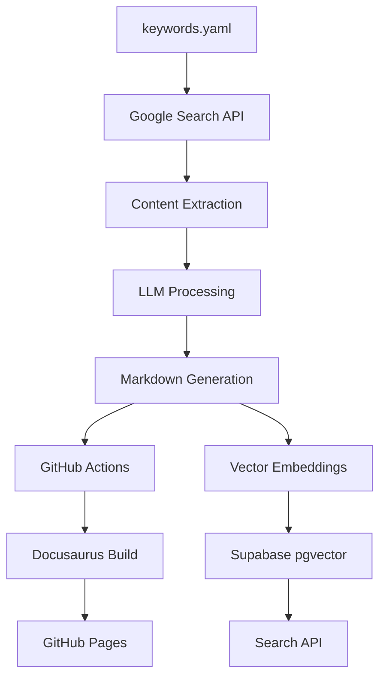

# 🤖 Tech Insight Harvester

> **Automated pipeline that harvests technology articles based on user-defined keywords, summarizes & tags them with an LLM, embeds content to pgvector on Supabase, and publishes a static site via Docusaurus + GitHub Pages.**

[](https://github.com/your-username/tech-insight-harvester/actions)
[](https://github.com/your-username/tech-insight-harvester/actions)

## ✨ Features

- **🔍 Automated Discovery**: Google Custom Search API finds fresh tech articles
- **🧠 LLM Processing**: GPT-4o generates SEO titles, summaries, and categorization
- **📝 Smart Publishing**: Automatic Docusaurus site generation and GitHub Pages deployment
- **🔎 Semantic Search**: Vector-powered search with pgvector on Supabase
- **⚡ Zero Maintenance**: Just edit `keywords.yaml` and everything else is automated

## 🚀 Quick Start

### 1. Setup Repository

```bash
# Clone the repository
git clone https://github.com/your-username/tech-insight-harvester.git
cd tech-insight-harvester

# Install dependencies
npm install
pip install -r requirements.txt
```

### 2. Configure Environment

Create a `.env` file in the root of the project and add your API keys.

Here is an example of what your `.env` file should look like:

```
# Google Custom Search API
# Used for crawling articles from Google Search.
# Create a new project here: https://console.cloud.google.com/
# Enable "Custom Search API" in the project's API & Services.
# Get API Key from "Credentials" page.
GOOGLE_API_KEY="your_google_api_key"

# Create a Programmable Search Engine here: https://programmablesearchengine.google.com/
# Get the "Search engine ID" from the overview page.
GOOGLE_CX_ID="your_google_cx_id"

# Mercury Parser API (optional)
# Used for extracting full content from articles.
# Get a free API key from https://mercury.parser.sh/
MERCURY_API_KEY="your_mercury_api_key"

# OpenAI API (optional)
# Used for article classification and summarization.
# Get an API key from https://platform.openai.com/api-keys
OPENAI_API_KEY="your_openai_api_key"

# Supabase (optional)
# Used for storing and managing crawled data.
# Create a project on https://supabase.com/
SUPABASE_URL="your_supabase_url"
SUPABASE_SERVICE_ROLE_KEY="your_supabase_service_role_key"
```

Required API keys:
- **Google Custom Search**: For article discovery
- **OpenAI**: For LLM processing and embeddings
- **Supabase**: For vector database storage
- **Mercury Parser** (optional): For better content extraction

### 3. Add Keywords

Edit `keywords.yaml` to define what topics to track:

```yaml
keywords:
  - "artificial intelligence"
  - "kubernetes deployment"
  - "serverless architecture"
  # Add your keywords here
```

### 4. Run Pipeline

```bash
# Manual run (for testing)
cd src
python crawler.py    # Discover articles
python reader.py     # Extract content
python llm.py        # Process with LLM
python md_writer.py  # Generate Markdown

# Start development server
npm start
```

## 🏗️ Architecture



### Pipeline Components

| Component | Purpose | Technology |
|-----------|---------|------------|
| **Crawler** | Article discovery | Google Custom Search API |
| **Reader** | Content extraction | BeautifulSoup + Mercury Parser |
| **LLM Processor** | SEO optimization & tagging | OpenAI GPT-4o |
| **Markdown Writer** | Documentation generation | Jinja2 templates |
| **Vector Ingestor** | Semantic indexing | OpenAI Embeddings + Supabase |
| **Search API** | Semantic search | FastAPI + pgvector |
| **Site Generator** | Static site | Docusaurus |

## 🔄 Automation Workflows

### Daily Content Pipeline (`crawl.yml`)
- **Schedule**: 06:00 JST daily
- **Triggers**: Cron schedule or manual dispatch
- **Actions**: Crawl → Extract → Process → Generate → Create PR

### Build & Deploy (`build.yml`)
- **Triggers**: Push to main, PR merge
- **Actions**: Build Docusaurus → Deploy to GitHub Pages → Lighthouse audit

### Vector Sync (`vector.yml`)
- **Triggers**: After successful build
- **Actions**: Generate embeddings → Sync to Supabase

## 📁 Project Structure

```
tech-insight-harvester/
├── 📄 keywords.yaml          # 👤 Human-editable keywords
├── 📄 tags.yaml             # 🏷️ LLM classification taxonomy
├── 📁 src/                  # 🐍 Python pipeline scripts
│   ├── crawler.py           # 🔍 Google Search API
│   ├── reader.py            # 📖 Content extraction
│   ├── llm.py              # 🧠 GPT-4o processing
│   ├── md_writer.py        # 📝 Markdown generation
│   ├── embed_ingest.py     # 🔢 Vector embeddings
│   └── search_api.py       # 🔎 Semantic search API
├── 📁 docs/auto/           # 📚 Generated articles
├── 📁 .github/workflows/   # ⚙️ GitHub Actions
├── 📁 templates/           # 📋 Jinja2 templates
└── 📁 output/              # 📊 Processing artifacts
```

## 🛠️ Configuration

### Keywords Configuration (`keywords.yaml`)

```yaml
keywords:
  - "large language models"
  - "kubernetes deployment"
  - "serverless architecture"

search_config:
  max_results_per_keyword: 10
  date_range: "week"
  language: "en"
```

### Tag Taxonomy (`tags.yaml`)

```yaml
ai:
  - llm
  - embeddings
  - transformers

cloud:
  - aws
  - kubernetes
  - serverless

# LLM will choose the most appropriate tag
```

## 🔧 API Endpoints

### Search API (Port 12001)

```bash
# Semantic search
GET /search?q=kubernetes%20deployment&limit=10

# Health check
GET /health

# Statistics
GET /stats
```

### Development Server (Port 12000)

```bash
# Start Docusaurus development server
npm start
```

## 📊 Monitoring & KPIs

- **Content Quality**: LLM-generated summaries and categorization
- **Search Performance**: Vector similarity search latency
- **Pipeline Health**: GitHub Actions success rates
- **Site Performance**: Lighthouse CI scores

## 🔒 Security & Best Practices

- ✅ No proprietary data in LLM processing
- ✅ Public web content only
- ✅ API keys stored in GitHub Secrets
- ✅ Branch protection on main
- ✅ Automated security scanning

## 🤝 Contributing

### Adding New Keywords
1. Edit `keywords.yaml`
2. Commit and push
3. Pipeline automatically processes new keywords

### Reviewing Content
1. Check daily PRs from `docs-ai-bot`
2. Review generated articles for quality
3. Merge if content is appropriate

### Customizing Processing
- Modify LLM prompts in `src/llm.py`
- Adjust content extraction in `src/reader.py`
- Update Markdown templates in `templates/`

## 📈 Roadmap

- [ ] Multi-language support
- [ ] Custom content sources beyond Google Search
- [ ] Advanced content filtering and deduplication
- [ ] Integration with Slack/Discord for notifications
- [ ] Analytics dashboard for content performance
- [ ] RSS feed generation

## 🆘 Troubleshooting

### Common Issues

**Pipeline fails with API errors**
- Check API keys in GitHub Secrets
- Verify API quotas and limits
- Review error logs in GitHub Actions

**No new content generated**
- Verify keywords are discoverable
- Check search date range settings
- Review content extraction logs

**Search not working**
- Ensure Supabase connection is configured
- Check vector embedding generation
- Verify pgvector extension is enabled

### Debug Mode

```bash
# Run individual components for debugging
cd src
python -c "from config import Config; print(Config().keyword_list)"
python crawler.py
python reader.py
python llm.py
```

## 📄 License

MIT License - see [LICENSE](LICENSE) for details.

## 🙏 Acknowledgments

- [Docusaurus](https://docusaurus.io/) for static site generation
- [OpenAI](https://openai.com/) for LLM processing
- [Supabase](https://supabase.com/) for vector database
- [GitHub Actions](https://github.com/features/actions) for automation

---

**Built with ❤️ for the developer community**
